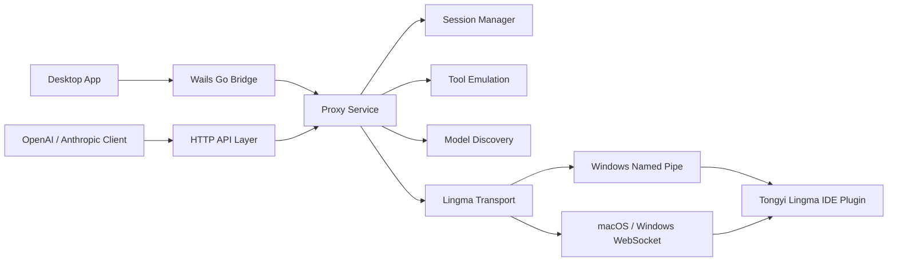

# Lingma IPC Proxy

[English](./README.md) | [简体中文](./README.zh-CN.md)

Lingma IPC Proxy exposes Tongyi Lingma's local IDE plugin capability as standard **OpenAI-compatible** and **Anthropic-compatible** HTTP APIs. It can be used as a CLI proxy service or as a cross-platform desktop app for macOS and Windows.

The project is designed for tools such as Claude Code, Cline, Continue, OpenCode, custom agents, and any client that can talk to OpenAI or Anthropic style APIs.

## Current Version

The current desktop line is `v1.2.0`.

Release builds are produced by GitHub Actions for:

| Asset | Platform | Purpose |
| --- | --- | --- |
| `lingma-ipc-proxy_<tag>_darwin_arm64.tar.gz` | macOS | CLI proxy |
| `lingma-ipc-proxy_<tag>_windows_amd64.zip` | Windows | CLI proxy |
| `lingma-ipc-proxy-desktop_<tag>_darwin_arm64.zip` | macOS | Desktop app |
| `lingma-ipc-proxy-desktop_<tag>_windows_amd64.zip` | Windows | Desktop app |
| `lingma-ipc-proxy_<tag>_sha256.txt` | all | Checksums |

## Desktop App

The desktop app wraps the proxy with a native-feeling control panel:

- Start, stop, and restart the proxy.
- Inspect health, latency, recent requests, models, settings, and logs.
- View full request and response bodies with internal scrolling and hidden scrollbars.
- Copy endpoint URLs, model IDs, request logs, and response logs with visible feedback.
- Detect Lingma IPC paths automatically on macOS and Windows, with manual fallback settings.
- Follow system theme automatically, or switch light/dark mode manually.
- Keep the proxy running when the window is closed; quit explicitly from the app/menu.

### Screenshots

Light mode:


Dark mode:


Narrow window layout:


## Supported APIs

| API | Endpoint | Support |
| --- | --- | --- |
| Health | `GET /` and `GET /health` | supported |
| Models | `GET /v1/models` | supported |
| OpenAI Chat Completions | `POST /v1/chat/completions` | streaming and non-streaming |
| Anthropic Messages | `POST /v1/messages` | streaming and non-streaming |

## What This Fork Adds

Compared with the original protocol proof of concept, this repository focuses on making the proxy usable as a complete local product:

- **Function Calling / Tools** for both OpenAI and Anthropic clients.
- **Tool result continuation** for multi-step agent loops.
- **Image input** for OpenAI `image_url` and Anthropic image blocks.
- **More request parameter compatibility** so stricter clients can connect without custom patches.
- **Full request and response recording** in the desktop app for debugging 400/500 errors.
- **macOS and Windows desktop app** with start/stop/restart, settings, logs, model discovery, themes, and window lifecycle handling.
- **Cross-platform release packaging** for CLI and desktop builds.

### OpenAI Compatibility

The proxy accepts common OpenAI request fields:

- `model`, `messages`, `stream`
- `temperature`, `top_p`, `stop`
- `max_tokens`, `max_completion_tokens`
- `presence_penalty`, `frequency_penalty`
- `tools`, `tool_choice`, `parallel_tool_calls`
- `response_format`, `seed`, `user`, `reasoning_effort`
- image input through `image_url` data URLs or HTTP URLs

### Anthropic Compatibility

The proxy accepts common Anthropic request fields:

- `model`, `system`, `messages`, `stream`
- `temperature`, `top_p`, `top_k`, `stop_sequences`
- `max_tokens`, `metadata`
- `tools`, `tool_choice`
- image blocks through base64 sources
- tool result continuation blocks

## Architecture



### Module Layout

| Path | Responsibility |
| --- | --- |
| `cmd/lingma-ipc-proxy` | CLI entrypoint, config loading, signal handling |
| `internal/httpapi` | OpenAI/Anthropic HTTP routes, streaming SSE responses, request recording |
| `internal/service` | request orchestration, sessions, model discovery, proxy lifecycle |
| `internal/lingmaipc` | Lingma JSON-RPC transport over Named Pipe and WebSocket |
| `internal/toolemulation` | tool definition injection, action block parsing, tool result projection |
| `desktop` | Wails desktop shell, native window commands, proxy control bridge |
| `desktop/frontend` | Vue UI for dashboard, requests, models, settings, and logs |
| `.github/workflows/release.yml` | CI release pipeline for macOS and Windows CLI/Desktop packages |

## Transport Detection

| Platform | Default transport | Detection |
| --- | --- | --- |
| macOS | WebSocket | reads Lingma `SharedClientCache` files under user application support paths |
| Windows | Named Pipe / WebSocket | scans Lingma named pipes and shared cache hints |
| Linux | WebSocket | manual `--ws-url` is recommended |

If auto detection fails, set the path manually in the desktop Settings page or pass CLI flags:

```bash
lingma-ipc-proxy --transport websocket --ws-url ws://127.0.0.1:36510 --port 8095
lingma-ipc-proxy --transport pipe --pipe-name '\\.\pipe\lingma-ipc'
```

## Quick Start

### Desktop App

1. Install VS Code and the Tongyi Lingma extension.
2. Log in to Tongyi Lingma and verify the Lingma panel can chat normally.
3. Download the desktop asset from [Releases](https://github.com/Lutiancheng1/lingma-ipc-proxy/releases).
4. Start `Lingma IPC Proxy`.
5. Click `探测模型` after the proxy is running.
6. Configure clients to use `http://127.0.0.1:8095`.

### CLI

```bash
git clone https://github.com/Lutiancheng1/lingma-ipc-proxy.git
cd lingma-ipc-proxy
go build -o ./dist/lingma-ipc-proxy ./cmd/lingma-ipc-proxy
./dist/lingma-ipc-proxy --host 127.0.0.1 --port 8095 --session-mode auto
```

Windows:

```powershell
.\scripts\build.ps1
.\dist\lingma-ipc-proxy.exe --host 127.0.0.1 --port 8095 --session-mode auto
```

## Client Configuration

### Claude Code

```bash
export ANTHROPIC_BASE_URL="http://127.0.0.1:8095"
export ANTHROPIC_API_KEY="any"
```

Then select a model in Claude Code:

```text
/model Qwen3-Coder
```

### Cline

- Provider: `OpenAI Compatible`
- Base URL: `http://127.0.0.1:8095/v1`
- API Key: `any`
- Model ID: `Qwen3-Coder`

### Continue

```json
{
  "models": [
    {
      "title": "Lingma Proxy",
      "provider": "openai",
      "model": "Qwen3-Coder",
      "apiKey": "any",
      "apiBase": "http://127.0.0.1:8095/v1"
    }
  ]
}
```

## Models

The proxy reports the models exposed by the Lingma plugin. The desktop app does not force a global model switch; the calling client should specify the `model` field. Clicking a model in the desktop app copies its model ID.

Observed model IDs include:

- `Auto`
- `Kimi-K2.6`
- `MiniMax-M2.7`
- `Qwen3-Coder`
- `Qwen3-Max`
- `Qwen3-Thinking`
- `Qwen3.6-Plus`

For tool-heavy coding workflows, `Qwen3-Coder` is the recommended first choice.

## Configuration

Default config file:

```text
./lingma-ipc-proxy.json
```

Example:

```json
{
  "host": "127.0.0.1",
  "port": 8095,
  "transport": "auto",
  "mode": "agent",
  "shell_type": "zsh",
  "session_mode": "auto",
  "timeout": 120,
  "cwd": "/Users/you/project",
  "current_file_path": ""
}
```

Priority order:

1. built-in defaults
2. JSON config file
3. environment variables
4. command-line flags
5. desktop Settings page updates

## Function Calling / Tool Calling

Lingma does not expose a native public OpenAI/Anthropic tool-call protocol, so this proxy emulates tool calling:

1. Normalize OpenAI or Anthropic tool definitions.
2. Inject tool contracts into the Lingma prompt.
3. Parse model action blocks from the response.
4. Convert parsed actions back into OpenAI `tool_calls` or Anthropic `tool_use`.
5. Feed tool results back into Lingma for continuation.

This is most reliable with `Qwen3-Coder`.

## Local Desktop Build

Install Wails:

```bash
go install github.com/wailsapp/wails/v2/cmd/wails@v2.12.0
```

Build macOS:

```bash
npm ci --prefix desktop/frontend
cd desktop
wails build -platform darwin/arm64 -clean
```

Build Windows on Windows:

```powershell
npm ci --prefix desktop/frontend
cd desktop
wails build -platform windows/amd64 -clean
```

The desktop bundle name is always `Lingma IPC Proxy`.

## Release Plan

The release workflow is triggered by:

- pushing a tag such as `v1.2.0`
- manually running the `Release` workflow with a tag input

Planned improvements:

- macOS signing and notarization
- Windows installer packaging
- configurable log retention
- request export/import
- richer model metadata display
- optional Linux desktop packaging after the Lingma transport story is stable

## Acknowledgements

This project is based on the protocol insight and initial discovery work from [coolxll/lingma-ipc-proxy](https://github.com/coolxll/lingma-ipc-proxy). The core idea of connecting to Lingma's private local IPC protocol and exposing standard API endpoints came from that project. This fork extends the implementation with broader OpenAI/Anthropic compatibility, tool emulation, image handling, desktop app support, request/log inspection, cross-platform packaging, and release automation.
