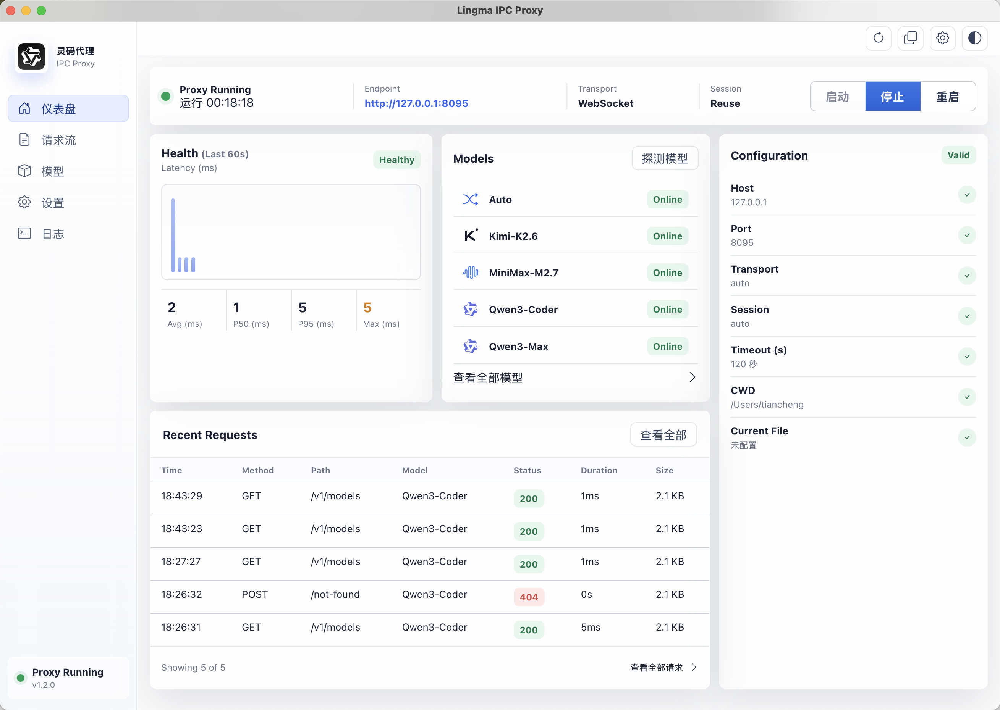
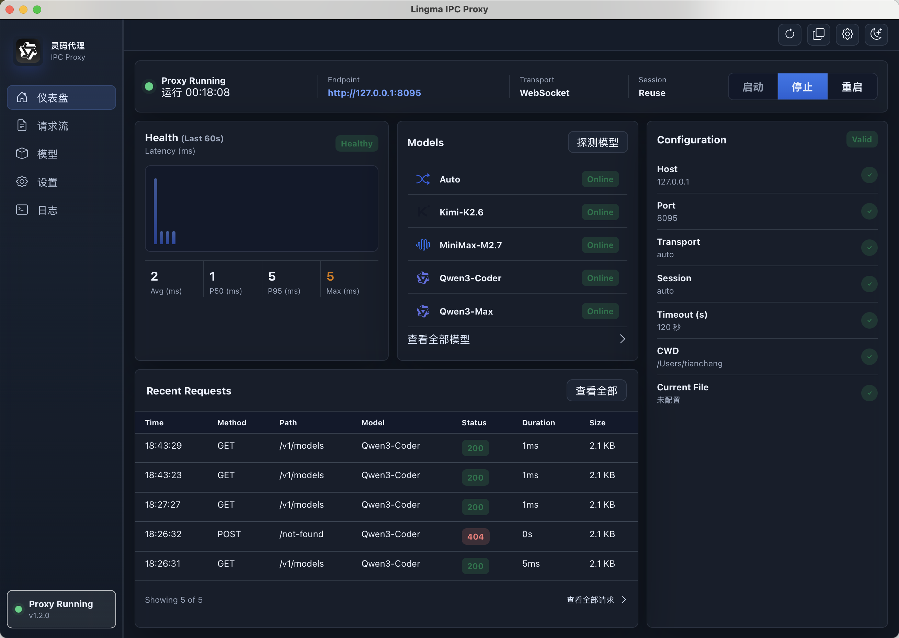
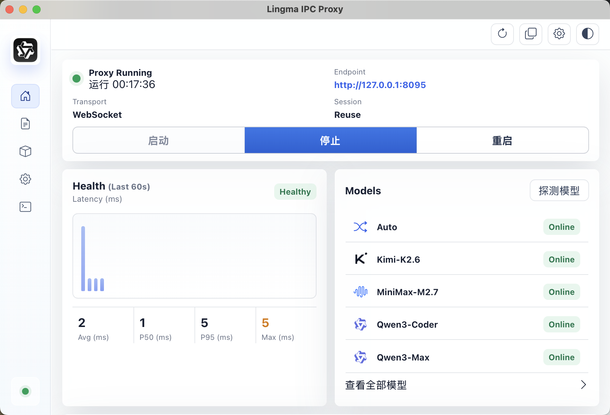
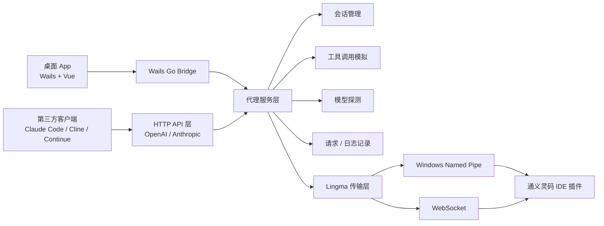

# Lingma IPC Proxy

[English](./README.md) | [简体中文](./README.zh-CN.md)

**Lingma IPC Proxy** 是一个通义灵码 IDE 插件 API 适配层。它把 Lingma 插件的本地私有 IPC / WebSocket 能力转换成标准 **OpenAI 兼容接口** 和 **Anthropic 兼容接口**，让 Claude Code、Cline、Continue、OpenCode、自研 Agent 等第三方客户端可以直接调用 Lingma 后端模型。

项目同时提供两种使用方式：

- **CLI 代理服务**：适合后台常驻、脚本化和服务器式运行。
- **跨平台桌面 App**：适合日常可视化管理，支持 macOS 和 Windows。

## 当前版本

当前桌面端版本线：`v1.2.0`

GitHub Actions 会在 Release 中产出：

| 产物 | 平台 | 用途 |
| --- | --- | --- |
| `lingma-ipc-proxy_<tag>_darwin_arm64.tar.gz` | macOS | CLI 代理 |
| `lingma-ipc-proxy_<tag>_windows_amd64.zip` | Windows | CLI 代理 |
| `lingma-ipc-proxy-desktop_<tag>_darwin_arm64.zip` | macOS | 桌面 App |
| `lingma-ipc-proxy-desktop_<tag>_windows_amd64.zip` | Windows | 桌面 App |
| `lingma-ipc-proxy_<tag>_sha256.txt` | 全平台 | 校验文件 |

## 功能概览

| 能力 | 状态 |
| --- | --- |
| OpenAI Chat Completions | 支持流式 / 非流式 |
| Anthropic Messages | 支持流式 / 非流式 |
| `GET /v1/models` | 支持 |
| Function Calling / Tools | 支持，使用工具调用模拟实现 |
| 多轮 Agent 工具循环 | 支持 |
| 图片输入 | 支持 base64、data URL、HTTP URL |
| 请求 / 响应完整日志 | 桌面端支持完整查看和复制 |
| macOS WebSocket 自动探测 | 支持 |
| Windows Named Pipe / WebSocket 探测 | 支持 |
| 日间 / 夜间 / 跟随系统主题 | 桌面端支持 |
| macOS 窗口生命周期 | 关闭隐藏、Dock 重新打开、Cmd+W、Cmd+M、Cmd+Q |
| GitHub Release 打包 | macOS + Windows，CLI + Desktop |

## 桌面 App

桌面端是一个 Wails + Vue 实现的本地控制台，用来管理代理进程和观察真实请求。

主要页面：

- **仪表盘**：代理状态、监听地址、启动 / 停止 / 重启、健康延迟、模型摘要、配置摘要、最近请求。
- **请求流**：查看 OpenAI / Anthropic 兼容接口的请求记录，支持搜索、筛选、清空、完整请求体 / 响应体查看和复制。
- **模型**：探测 Lingma 插件暴露的可用模型，点击模型复制模型 ID。模型选择由调用方请求里的 `model` 字段决定，App 不再做无意义的全局切换。
- **设置**：主机、端口、传输方式、超时、WebSocket 地址、Named Pipe、工作目录、当前文件、会话策略等。
- **日志**：代理启动、模型同步、健康检查、配置保存、错误事件等。

### 截图

日间模式：



夜间模式：



窄窗口 / 小屏布局：



## 支持的协议和接口

### HTTP 端点

| 端点 | 方法 | 说明 |
| --- | --- | --- |
| `/` | GET | 健康检查 |
| `/health` | GET | 健康检查 |
| `/v1/models` | GET | 获取 Lingma 可用模型列表 |
| `/v1/chat/completions` | POST | OpenAI Chat Completions 兼容接口 |
| `/v1/messages` | POST | Anthropic Messages 兼容接口 |

## 我们自己增强的能力

相对最初的协议验证版本，本仓库重点把它完善成一个可日常使用的本地代理产品：

- **Function Calling / Tools 兼容**：同时兼容 OpenAI `tools/tool_choice` 和 Anthropic `tools/tool_choice`。
- **工具结果接力**：支持多轮 Agent 工具调用，把工具结果继续回灌给 Lingma 生成最终回答。
- **图片输入**：兼容 OpenAI `image_url` 和 Anthropic base64 image block。
- **更完整的参数兼容**：接收 `temperature`、`top_p`、`stop`、`max_tokens`、`response_format`、`reasoning_effort` 等客户端常用字段。
- **完整请求 / 响应观测**：桌面端可以查看完整请求体、响应体、状态码、耗时和错误日志，便于排查 Claude Code / Cline 里的 400、500 问题。
- **跨平台桌面 App**：提供启动、停止、重启、模型探测、设置、日志、主题、窗口生命周期等完整桌面能力。
- **跨平台 Release**：GitHub Actions 同时打包 macOS / Windows 的 CLI 和桌面 App。

### OpenAI 兼容内容

支持常见 OpenAI 请求字段：

- `model`
- `messages`
- `stream`
- `temperature`
- `top_p`
- `stop`
- `max_tokens`
- `max_completion_tokens`
- `presence_penalty`
- `frequency_penalty`
- `tools`
- `tool_choice`
- `parallel_tool_calls`
- `response_format`
- `seed`
- `user`
- `reasoning_effort`
- `image_url`

说明：部分生成参数取决于 Lingma 后端是否实际采纳，代理层会尽量接收、归一化并保持客户端兼容。

### Anthropic 兼容内容

支持常见 Anthropic 请求字段：

- `model`
- `system`
- `messages`
- `stream`
- `temperature`
- `top_p`
- `top_k`
- `stop_sequences`
- `max_tokens`
- `metadata`
- `tools`
- `tool_choice`
- `tool_result`
- base64 图片块

## 架构设计



### 目录结构

| 路径 | 职责 |
| --- | --- |
| `cmd/lingma-ipc-proxy` | CLI 入口，配置加载，HTTP 服务启动，系统信号处理 |
| `internal/httpapi` | OpenAI / Anthropic 路由、请求解析、SSE 流式响应、请求记录 |
| `internal/service` | 业务编排、会话生命周期、模型探测、代理运行状态 |
| `internal/lingmaipc` | Lingma JSON-RPC 通信，Named Pipe / WebSocket 传输 |
| `internal/toolemulation` | 工具定义注入、动作块解析、工具结果回灌 |
| `desktop` | Wails 桌面壳、窗口命令、代理生命周期桥接 |
| `desktop/frontend` | Vue 前端页面，包含仪表盘、请求流、模型、设置、日志 |
| `docs/images` | README 截图素材 |
| `.github/workflows/release.yml` | macOS / Windows CLI + Desktop release 打包 |

### 请求链路

1. 客户端请求 `http://127.0.0.1:8095/v1/chat/completions` 或 `/v1/messages`。
2. HTTP 层识别 OpenAI / Anthropic 请求格式。
3. Service 层归一化消息、图片、工具定义和参数。
4. Session 管理层决定复用会话、创建新会话或使用自动策略。
5. Transport 层连接 Lingma 插件的 Named Pipe 或 WebSocket。
6. Lingma 返回增量事件或最终响应。
7. HTTP 层转换成 OpenAI SSE、Anthropic SSE 或普通 JSON。
8. 桌面端同步记录请求、响应、耗时、状态码和日志。

## Lingma 路径自动探测

| 平台 | 优先传输 | 探测方式 |
| --- | --- | --- |
| macOS | WebSocket | 扫描用户目录下 Lingma `SharedClientCache` 配置 |
| Windows | Named Pipe / WebSocket | 扫描 Lingma 命名管道和共享缓存信息 |
| Linux | WebSocket | 建议手动指定 `--ws-url` |

如果自动探测失败，桌面端会提供兜底说明。可以在设置里手动填写：

- macOS WebSocket 示例：`ws://127.0.0.1:36510`
- Windows Named Pipe 示例：`\\.\pipe\lingma-ipc`
- 代理监听地址示例：`http://127.0.0.1:8095`

CLI 也可以手动指定：

```bash
lingma-ipc-proxy --transport websocket --ws-url ws://127.0.0.1:36510 --port 8095
lingma-ipc-proxy --transport pipe --pipe-name '\\.\pipe\lingma-ipc'
```

## 快速开始

### 前置条件

1. 安装 VS Code。
2. 安装通义灵码插件：`Alibaba-Cloud.tongyi-lingma`。
3. 登录通义灵码账号。
4. 在 VS Code 中确认 Lingma 面板可以正常聊天。

### 使用桌面 App

1. 前往 [Releases](https://github.com/Lutiancheng1/lingma-ipc-proxy/releases) 下载桌面版。
2. macOS 解压后打开 `Lingma IPC Proxy.app`。
3. Windows 解压后运行桌面版 exe。
4. 点击启动代理。
5. 点击 `探测模型`。
6. 在 Claude Code / Cline / Continue 中配置本地地址。

### 使用 CLI

macOS：

```bash
git clone https://github.com/Lutiancheng1/lingma-ipc-proxy.git
cd lingma-ipc-proxy
go build -o ./dist/lingma-ipc-proxy ./cmd/lingma-ipc-proxy
./dist/lingma-ipc-proxy --host 127.0.0.1 --port 8095 --session-mode auto
```

Windows：

```powershell
git clone https://github.com/Lutiancheng1/lingma-ipc-proxy.git
cd lingma-ipc-proxy
.\scripts\build.ps1
.\dist\lingma-ipc-proxy.exe --host 127.0.0.1 --port 8095 --session-mode auto
```

## 客户端配置

### Claude Code

```bash
export ANTHROPIC_BASE_URL="http://127.0.0.1:8095"
export ANTHROPIC_API_KEY="any"
```

注意：`ANTHROPIC_BASE_URL` 不要带 `/v1`，Claude SDK 会自动追加。

然后在 Claude Code 中选择模型：

```text
/model Qwen3-Coder
```

### Cline

选择 `OpenAI Compatible`：

- Base URL：`http://127.0.0.1:8095/v1`
- API Key：`any`
- Model ID：`Qwen3-Coder`

### Continue

```json
{
  "models": [
    {
      "title": "Lingma Proxy",
      "provider": "openai",
      "model": "Qwen3-Coder",
      "apiKey": "any",
      "apiBase": "http://127.0.0.1:8095/v1"
    }
  ]
}
```

## 模型说明

模型列表来自 Lingma 插件，不是代理内置静态列表。桌面端仅负责展示和复制模型 ID，真正使用哪个模型由调用方请求里的 `model` 字段决定。

当前常见模型：

| 模型 | 说明 |
| --- | --- |
| `Auto` | Lingma 自动路由模型，桌面端使用通用自动图标 |
| `Qwen3-Coder` | 代码和工具调用优先推荐 |
| `Qwen3-Max` | 通用能力较强 |
| `Qwen3-Thinking` | 推理类模型 |
| `Qwen3.6-Plus` | 通用模型 |
| `Kimi-K2.6` | 长文本模型 |
| `MiniMax-M2.7` | 通用模型 |

需要工具调用时，优先使用 `Qwen3-Coder`。

## 配置文件

默认读取：

```text
./lingma-ipc-proxy.json
```

完整示例：

```json
{
  "host": "127.0.0.1",
  "port": 8095,
  "transport": "auto",
  "mode": "agent",
  "shell_type": "zsh",
  "session_mode": "auto",
  "timeout": 120,
  "cwd": "/Users/tiancheng/project",
  "current_file_path": ""
}
```

配置优先级从低到高：

1. 内置默认值
2. JSON 配置文件
3. 环境变量
4. 命令行参数
5. 桌面端设置页保存的配置

## 工具调用实现

Lingma 插件本身没有公开标准 OpenAI / Anthropic Tools 协议，所以本项目使用 **Tool Emulation**：

1. 接收 OpenAI `tools` / Anthropic `tools`。
2. 将工具定义转成 Lingma 可理解的提示词上下文。
3. 引导模型输出结构化 action block。
4. 解析 action block。
5. 重新编码成 OpenAI `tool_calls` 或 Anthropic `tool_use`。
6. 将工具执行结果回灌给 Lingma，继续生成最终回答。

该方案依赖模型配合，目前 `Qwen3-Coder` 最稳定。

## 请求和日志观测

桌面端会记录：

- 请求时间
- HTTP 方法
- 路径
- 状态码
- 耗时
- 请求体
- 响应体
- 错误原因
- 代理运行日志

请求体和响应体不会再用无意义的展开 / 收起按钮截断展示；内容过长时会在详情区域内部滚动，并隐藏滚动条，便于小窗口下查看完整内容。

## 本地构建桌面端

安装 Wails：

```bash
go install github.com/wailsapp/wails/v2/cmd/wails@v2.12.0
```

macOS：

```bash
npm ci --prefix desktop/frontend
cd desktop
wails build -platform darwin/arm64 -clean
```

Windows：

```powershell
npm ci --prefix desktop/frontend
cd desktop
wails build -platform windows/amd64 -clean
```

桌面端最终 App 名称统一为：

```text
Lingma IPC Proxy
```

不会再生成 `lingma-proxy-desktop` 旧包名。

## GitHub Actions Release

发布方式：

```bash
git tag v1.2.0
git push origin v1.2.0
```

也可以在 GitHub Actions 页面手动运行 `Release` workflow，并输入 tag。

Release workflow 会执行：

1. `go test ./...`
2. 构建 macOS CLI
3. 构建 Windows CLI
4. 构建 macOS 桌面 App
5. 构建 Windows 桌面 App
6. 生成 SHA256 校验文件
7. 上传到 GitHub Release

## 与上游项目的关系

我对比了上游仓库 [coolxll/lingma-ipc-proxy](https://github.com/coolxll/lingma-ipc-proxy)。上游项目的核心贡献是发现并验证了 Lingma 本地私有 IPC 协议可以被代理成标准 HTTP API，这是本项目的基础思路来源。

本项目在这个思路上继续扩展了：

- 更完整的 OpenAI / Anthropic 参数兼容
- Tools / Function Calling 模拟
- 图片输入处理
- 会话策略和多轮工具调用
- macOS / Windows 自动探测兜底
- Wails 桌面 App
- 请求流、日志、设置、模型页面
- 日间 / 夜间 / 跟随系统主题
- App 图标和模型图标
- macOS / Windows CLI + Desktop release 打包

## 后续计划

- macOS 签名与 notarization
- Windows installer 安装包
- 请求日志导出
- 日志保留时长配置
- 更丰富的模型元数据
- 桌面端自动更新
- Linux 桌面版可行性验证

## 致谢

本项目的协议实现思路参考并继承自 [coolxll/lingma-ipc-proxy](https://github.com/coolxll/lingma-ipc-proxy) 的协议发现工作。Lingma 私有本地 IPC 可以被转换为标准 OpenAI / Anthropic API 这一核心思想是该项目首先验证出来的；本项目在此基础上补充了更完整的协议兼容、工具调用、图片处理、桌面 App、请求 / 日志观测、跨平台打包和 release 自动化。
