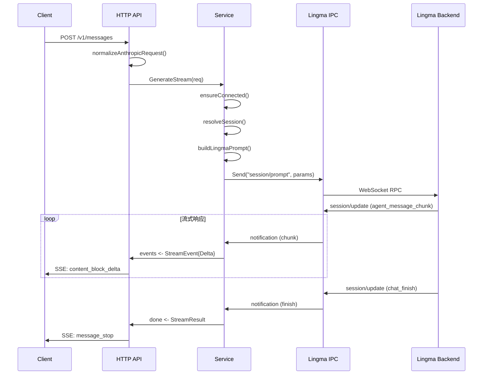
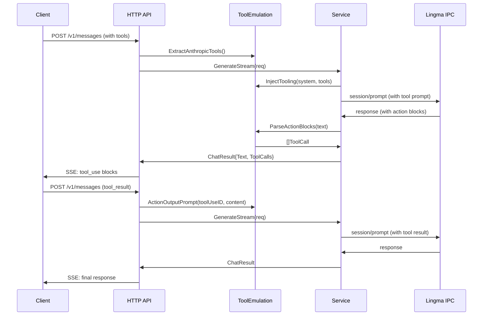
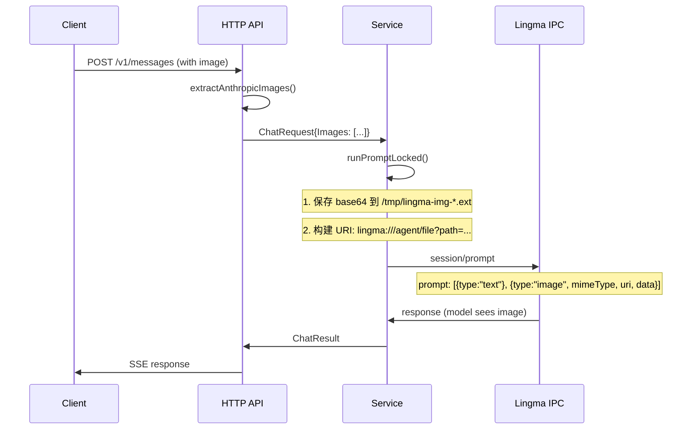

# lingma-ipc-proxy 架构文档

本文档描述 lingma-ipc-proxy 的系统架构、工作原理和核心流程。

---

## 1. 整体架构

```
┌─────────────────────────────────────────────────────────────────────────┐
│                              客户端层                                     │
│  ┌──────────────┐  ┌──────────────┐  ┌──────────────┐  ┌──────────────┐ │
│  │ Claude Code  │  │   OpenAI     │  │   Cline      │  │   Continue   │ │
│  │  (Anthropic) │  │    SDK       │  │  (OpenAI)    │  │  (OpenAI)    │ │
│  └──────┬───────┘  └──────┬───────┘  └──────┬───────┘  └──────┬───────┘ │
└─────────┼─────────────────┼─────────────────┼─────────────────┼─────────┘
          │                 │                 │                 │
          └─────────────────┴────────┬────────┴─────────────────┘
                                     │ HTTP
                                     ▼
┌─────────────────────────────────────────────────────────────────────────┐
│                         lingma-ipc-proxy                                │
│  ┌─────────────────────────────────────────────────────────────────┐    │
│  │  internal/httpapi                                                │    │
│  │  ┌─────────────┐  ┌─────────────┐  ┌─────────────────────────┐ │    │
│  │  │ /v1/models  │  │/v1/chat/comp│  │    /v1/messages         │ │    │
│  │  │  (GET)      │  │  (POST)     │  │    (POST)               │ │    │
│  │  └──────┬──────┘  └──────┬──────┘  └───────────┬─────────────┘ │    │
│  │         └─────────────────┴──────────┬──────────┘               │    │
│  │                                      │ normalizeRequest         │    │
│  │                                      ▼                          │    │
│  │  ┌─────────────────────────────────────────────────────────┐   │    │
│  │  │              internal/service                            │   │    │
│  │  │  ┌──────────┐  ┌──────────┐  ┌────────────────────────┐ │   │    │
│  │  │  │ Session  │  │  Prompt  │  │    Stream/Event        │ │   │    │
│  │  │  │ Manager  │  │ Builder  │  │    Handler             │ │   │    │
│  │  │  └────┬─────┘  └────┬─────┘  └───────────┬────────────┘ │   │    │
│  │  │       └─────────────┴──────────┬─────────┘              │   │    │
│  │  │                              │ buildLingmaPrompt       │   │    │
│  │  │                              ▼                          │   │    │
│  │  │  ┌─────────────────────────────────────────────────┐   │   │    │
│  │  │  │          internal/lingmaipc                      │   │   │    │
│  │  │  │  ┌──────────────┐  ┌──────────────────────────┐ │   │   │    │
│  │  │  │  │   WebSocket  │  │    Named Pipe (Win)      │ │   │   │    │
│  │  │  │  │  Transport   │  │    Transport             │ │   │   │    │
│  │  │  │  └──────┬───────┘  └───────────┬──────────────┘ │   │   │    │
│  │  │  └─────────┼──────────────────────┼────────────────┘   │   │    │
│  │  └────────────┼──────────────────────┼────────────────────┘   │    │
│  │               │                      │                         │    │
│  │  ┌────────────┼──────────────────────┼────────────────────┐   │    │
│  │  │            ▼                      ▼                    │   │    │
│  │  │  ┌─────────────────────────────────────────────────┐  │   │    │
│  │  │  │      internal/toolemulation                      │  │   │    │
│  │  │  │  ┌──────────────┐  ┌──────────────────────────┐ │  │   │    │
│  │  │  │  │InjectTooling │  │   ParseActionBlocks      │ │  │   │    │
│  │  │  │  │  (Prompt)    │  │   (Response)             │ │  │   │    │
│  │  │  │  └──────────────┘  └──────────────────────────┘ │  │   │    │
│  │  │  └─────────────────────────────────────────────────┘  │   │    │
│  │  └───────────────────────────────────────────────────────┘   │    │
│  └───────────────────────────────────────────────────────────────┘    │
└─────────────────────────────────────────────────────────────────────────┘
                                     │
                                     │ WebSocket / Named Pipe
                                     ▼
┌─────────────────────────────────────────────────────────────────────────┐
│                         Lingma 后端进程                                  │
│              (VS Code 插件的本地 IPC 服务)                                │
│                   ws://127.0.0.1:8899/ws                                │
└─────────────────────────────────────────────────────────────────────────┘
                                     │
                                     │ HTTP API
                                     ▼
┌─────────────────────────────────────────────────────────────────────────┐
│                         云端模型服务                                     │
│              (Kimi-K2.6 / Qwen3-Max / MiniMax-M2.7 等)                  │
└─────────────────────────────────────────────────────────────────────────┘
```

---

## 2. 模块职责

### 2.1 internal/httpapi

HTTP API 适配层，负责将外部请求转换为内部 `service.ChatRequest`。

| 端点 | 协议 | 功能 |
|------|------|------|
| `GET /v1/models` | OpenAI | 返回可用模型列表 |
| `POST /v1/chat/completions` | OpenAI | 聊天补全（流式/非流式） |
| `POST /v1/messages` | Anthropic | 消息接口（流式/非流式） |

**核心函数：**
- `handleOpenAIChatCompletions()` - 处理 OpenAI 格式请求
- `handleAnthropicMessages()` - 处理 Anthropic 格式请求
- `normalizeOpenAIRequest()` / `normalizeAnthropicRequest()` - 归一化请求

**关键设计：**
- 支持 CORS 预检请求 (`OPTIONS`)
- 单请求并发控制 (`tryAcquire()` / `release()`)
- 流式响应通过 `http.Flusher` 实现 SSE

### 2.2 internal/service

业务逻辑层，负责会话管理和 Prompt 构建。

**核心结构：**
```go
type Service struct {
    cfg              Config
    client           *lingmaipc.Client
    stickySessionID  string
    stickyModelID    string
}
```

**核心函数：**
- `Generate()` - 非流式生成
- `GenerateStream()` - 流式生成（返回 `events` + `done` channel）
- `buildLingmaPrompt()` - 构建 Lingma 原生 Prompt
- `runPromptLocked()` - 发送 `session/prompt` RPC 并监听 `session/update` 通知

**会话模式：**
| 模式 | 行为 |
|------|------|
| `reuse` | 复用 sticky session，多轮对话保持上下文 |
| `fresh` | 每个请求新建临时 session，完成后删除 |
| `auto` | 单轮请求复用；带 system/history 的请求用 fresh |

### 2.3 internal/lingmaipc

IPC 通信层，负责与 Lingma 后端进程建立连接。

**传输方式：**
| 平台 | 默认传输 | 说明 |
|------|----------|------|
| Windows | Named Pipe | `\\.\pipe\lingma-*` |
| macOS/Linux | WebSocket | `ws://127.0.0.1:{port}/ws` |

**连接发现：**
- 读取 VS Code 插件缓存：`~/.config/Lingma/SharedClientCache/.info.json`
- 获取 WebSocket 端口号
- 自动重连机制

**RPC 协议：**
- `session/new` - 创建会话
- `session/prompt` - 发送用户消息
- `session/update` - 接收流式响应通知
- `session/set_model` - 切换模型
- `chat/deleteSessionById` - 删除会话

### 2.4 internal/toolemulation

Tool 调用模拟层，将标准 `tools` 协议转换为 Prompt 层契约。

**核心流程：**
```
Client tools ──→ ExtractAnthropicTools() ──→ []Tool
                    │
                    ▼
              InjectTooling() ──→ System Prompt + Tool 说明
                    │
                    ▼
              模型输出 action block
                    │
                    ▼
              ParseActionBlocks() ──→ []ToolCall
                    │
                    ▼
              编码为 Anthropic tool_use / OpenAI tool_calls
```

**Prompt 契约格式：**
```
```json action
{"tool":"NAME","parameters":{"key":"value"}}
```
```

**支持格式：**
- `{"tool":"X","parameters":{}}` ✅ 标准格式
- `{"tool":"X","arguments":{}}` ✅ 兼容格式
- `{"tool":"X","input":{}}` ✅ 兼容格式
- `{"tool":"X","arg1":"val"}` ✅ 顶层参数（部分模型）

---

## 3. 核心流程

### 3.1 普通聊天请求流程



### 3.2 Tool 调用流程



### 3.3 图片传输流程



### 3.4 流式输出 SSE 事件序列

**Anthropic 格式（流式）：**
```
event: message_start
data: {"type":"message_start","message":{...}}

event: content_block_start
data: {"type":"content_block_start","index":0,"content_block":{"type":"text","text":""}}

event: content_block_delta
data: {"type":"content_block_delta","index":0,"delta":{"type":"text_delta","text":"你"}}

event: content_block_delta
data: {"type":"content_block_delta","index":0,"delta":{"type":"text_delta","text":"好"}}

... (更多 delta)

event: content_block_stop
data: {"type":"content_block_stop","index":0}

[如有 tool_calls]
event: content_block_start
data: {"type":"content_block_start","index":1,"content_block":{"type":"tool_use","id":"...","name":"Bash","input":{"command":"ls /"}}}

event: content_block_stop
data: {"type":"content_block_stop","index":1}

event: message_delta
data: {"type":"message_delta","delta":{"stop_reason":"end_turn"},"usage":{"output_tokens":5}}

event: message_stop
data: {"type":"message_stop"}
```

---

## 4. 关键技术决策

### 4.1 为什么使用 Tool Emulation 而非原生 Tool Calling？

Lingma 后端模型（Kimi、Qwen 等）不原生支持 OpenAI/Anthropic 的 `tools` 协议。因此代理层需要将工具定义注入到 Prompt 中，通过结构化文本输出模拟工具调用。

**优点：**
- 不依赖上游模型能力
- 兼容任何纯聊天模型
- 可精确控制 Prompt 格式

**缺点：**
- 模型需要学习特定格式
- 解析可能有容错问题
- 增加了 Prompt 长度

### 4.2 为什么使用 WebSocket/Named Pipe 而非 HTTP？

Lingma 插件使用本地 IPC 与后端通信，优势：
- 低延迟（本地通信）
- 双向实时通知（session/update）
- 认证信息由插件管理，代理无需处理

### 4.3 图片传输的双保险策略

```
Prompt 数组 (Lingma 原生格式):
[
  {"type":"text","text":"..."},
  {"type":"image","mimeType":"image/png","uri":"lingma:///agent/file?path=...","data":"base64..."}
]
```

- `uri`: Lingma 后端必须验证的本地文件路径
- `data`: base64 编码的图像数据（备用）
- `mimeType`: 图像类型标识

### 4.4 单请求并发控制

Lingma IPC 一次只能处理一个请求，因此代理使用 `tryAcquire()` 机制：

```go
if !s.tryAcquire() {
    writeAnthropicError(w, 429, "rate_limit_error",
        "Lingma IPC proxy handles one request at a time.")
    return
}
defer s.release()
```

---

## 5. 配置说明

### 5.1 配置文件结构

```json
{
  "host": "127.0.0.1",
  "port": 8095,
  "transport": "websocket",
  "mode": "agent",
  "shell_type": "zsh",
  "session_mode": "auto",
  "timeout": 120,
  "cwd": "/Users/tiancheng"
}
```

### 5.2 配置项说明

| 配置项 | 类型 | 默认值 | 说明 |
|--------|------|--------|------|
| `host` | string | `127.0.0.1` | HTTP 监听地址 |
| `port` | int | `8095` | HTTP 监听端口 |
| `transport` | string | `auto` | IPC 传输方式：`auto`/`pipe`/`websocket` |
| `mode` | string | `chat` | 模式：`chat`/`agent` |
| `shell_type` | string | `powershell` | 终端类型 |
| `session_mode` | string | `auto` | 会话模式：`reuse`/`fresh`/`auto` |
| `timeout` | int | `120` | 请求超时（秒） |
| `cwd` | string | `""` | 工作目录（传给 Lingma 后端） |

---

## 6. 扩展点

### 6.1 添加新模型

在 `service.go` 的模型映射中添加：

```go
func (s *Service) resolveInternalModelID(model string) string {
    switch strings.ToLower(strings.TrimSpace(model)) {
    case "kimi-k2.6":
        return "kimi2.6"
    case "qwen3-max":
        return "qwen3max"
    // 添加新模型映射
    default:
        return ""
    }
}
```

### 6.2 添加新 Tool 格式支持

在 `toolemulation.go` 的 `parseToolCallJSON()` 中扩展参数解析逻辑。

### 6.3 添加新 API 端点

在 `httpapi/server.go` 的 `NewServer()` 中注册新路由。

---

*文档版本: 2025-04-25*
*对应代码版本: 当前 master*
